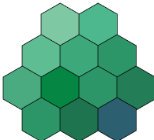

<p align="center">
    <a href="https://github.com/pkvartsianyi/spatio">
        
    </a>
</p>

<h1 align="center">Spatio</h1>

<p align="center">
  <a href="https://opensource.org/licenses/MIT">
    
  </a>
  <a href="https://crates.io/crates/spatio">
    
  </a>
  <a href="https://pypi.org/project/spatio">
    
  </a>
  <a href="https://pkvartsianyi.github.io/spatio/">
    
  </a>
  <a href="https://docs.rs/spatio">
    
  </a>
</p>

**Spatio** is a compact and efficient **embedded spatio-temporal database** written in Rust.
It's designed for **real-time 2D and 3D location data**, with **low memory usage**, **optional persistence**, and **native Python bindings**.

No SQL parser, no external dependencies, and requires no setup.

## Quick Start

### Python
```bash
pip install spatio
```

```python
import spatio

db = spatio.Spatio.memory()

# Store a point (longitude, latitude)
nyc = spatio.Point(-74.0060, 40.7128)
db.insert_point("cities", nyc, b"New York")

# Find nearby points
nearby = db.query_within_radius("cities", nyc, 100000, 10)
```

### Rust
```toml
[dependencies]
spatio = "0.1"
```

```rust
use spatio::prelude::*;

fn main() -> Result<()> {
    let mut db = Spatio::memory()?;

    let nyc = Point::new(-74.0060, 40.7128);
    db.insert_point("cities", &nyc, b"New York", None)?;

    let nearby = db.query_within_radius("cities", &nyc, 100_000.0, 10)?;
    println!("Found {} cities", nearby.len());

    Ok(())
}
```

## Features

- **Spatial queries:** Radius search, bounding box, K-nearest neighbours, polygon containment
- **3D support:** Altitude-aware indexing and 3D spatial queries (sphere, cylinder)
- **Trajectories:** Insert and query movement paths over time
- **Distance metrics:** Haversine, Geodesic, Rhumb line, and Euclidean calculations
- **Persistence:** Choose between snapshots (default) or append-only file (AOF)
- **Namespaces:** Logical separation of datasets within a single database instance
- **Lightweight:** No SQL parser, no external dependencies, no setup required
- **Cross-language:** Native Python bindings via PyO3
- **Edge-optimised:** Runs entirely in-process with low memory and zero network latency

## Examples

### 2D Spatial
```rust
// Insert points
db.insert_point("pois", &Point::new(-74.0, 40.7), b"Restaurant", None)?;

// Find nearby (within 1km)
let nearby = db.query_within_radius("pois", &center, 1000.0, 10)?;

// Bounding box query
let in_box = db.find_within_bounds("pois", 40.0, -75.0, 41.0, -73.0, 100)?;

// K-nearest neighbors
let nearest = db.knn("pois", &center, 5, 10_000.0, DistanceMetric::Haversine)?;
```

### 3D Spatial
```rust
use spatio::Point3d;

// Track drones with altitude
let drone = Point3d::new(-74.0060, 40.7128, 100.0);
db.insert_point_3d("drones", &drone, b"Alpha", None)?;

// 3D sphere query
let nearby = db.query_within_sphere_3d("drones", &drone, 200.0, 10)?;

// Cylindrical query (altitude range + radius)
let in_cylinder = db.query_within_cylinder_3d(
    "drones", &drone, 50.0, 150.0, 1000.0, 10
)?;
```

### Trajectories
```rust
use spatio::TemporalPoint;

let path = vec![
    TemporalPoint {
        point: Point::new(-74.00, 40.71),
        timestamp: UNIX_EPOCH + Duration::from_secs(100)
    },
    TemporalPoint {
        point: Point::new(-74.01, 40.72),
        timestamp: UNIX_EPOCH + Duration::from_secs(200)
    },
];

db.insert_trajectory("truck:001", &path, None)?;

// Query movement history
let history = db.query_trajectory("truck:001", 100, 300)?;
```

### TTL (Time-To-Live)
```rust
use spatio::SetOptions;

// Data expires in 1 hour
let opts = SetOptions::with_ttl(Duration::from_secs(3600));
db.insert("session:123", b"data", Some(opts))?;

// Expired items return None
let value = db.get("session:123")?;  // None if expired

// Clean up expired items manually
let removed = db.cleanup_expired()?;
```

**Important:** TTL is lazy - expired items stick around in memory until you call `cleanup_expired()` or they get overwritten. For long-running apps, clean up periodically or you'll leak memory.

### Persistence

**Snapshots (default):** Point-in-time saves, good for edge devices
```rust
let config = Config::default().with_snapshot_auto_ops(1000);
let db = DBBuilder::new()
    .snapshot_path("data.snapshot")
    .config(config)
    .build()?;
// Auto-saves every 1000 operations
```

**AOF (optional):** Write-ahead log, good for zero data loss
```rust
let db = DBBuilder::new()
    .aof_path("data.aof")
    .build()?;
// Requires --features aof
```

## Platforms

**Supported:**
- Linux (x86_64, aarch64)
- macOS (x86_64, arm64)

**Not supported:**
- Windows (not supported - use WSL2, Docker, or a Linux VM)

See [PLATFORMS.md](PLATFORMS.md) for details.

## API Overview

**Real-time Tracking:**
```rust
db.update_location(namespace, object_id, &position, metadata)?;
db.update_location_at(namespace, object_id, &position, metadata, timestamp)?;
```

**Object-Based Queries (Primary - Most Common):**
```rust
// Find objects near another object
db.query_near_object(namespace, object_id, radius, limit)?;
db.query_bbox_near_object(namespace, object_id, width, height, limit)?;
db.query_cylinder_near_object(namespace, object_id, min_z, max_z, radius, limit)?;
db.query_bbox_3d_near_object(namespace, object_id, width, height, depth, limit)?;
db.knn_near_object(namespace, object_id, k)?;
```

**Coordinate-Based Queries (When You Have Explicit Coordinates):**
```rust
db.query_current_within_radius(namespace, &center, radius, limit)?;
db.query_current_within_bbox(namespace, min_x, min_y, max_x, max_y, limit)?;
db.query_within_cylinder(namespace, &center, min_z, max_z, radius, limit)?;
db.query_within_bbox_3d(namespace, min_x, min_y, min_z, max_x, max_y, max_z, limit)?;
db.knn_3d(namespace, &center, k)?;
```

**Trajectories:**
```rust
db.insert_trajectory(namespace, object_id, &points)?;
db.query_trajectory(namespace, object_id, start_time, end_time, limit)?;
```

**Utility:**
```rust
db.stats();
db.close()?;
```

## Documentation

- **Examples:** [examples/](examples/) directory
- **Spatial features:** [SPATIAL_FEATURES.md](SPATIAL_FEATURES.md)
- **Platform support:** [PLATFORMS.md](PLATFORMS.md)
- **API docs:** [docs.rs/spatio](https://docs.rs/spatio)
- **Python docs:** [py-spatio/README.md](py-spatio/README.md)

## Status

Current version: **0.1.x** (active development)

APIs may change. Check [CHANGELOG.md](CHANGELOG.md) before upgrading.

## Contributing

Contributions are welcome! See [CONTRIBUTING.md](CONTRIBUTING.md).

## License

MIT - see [LICENSE](LICENSE)

## Links

- **GitHub:** https://github.com/pkvartsianyi/spatio
- **Crates.io:** https://crates.io/crates/spatio
- **PyPI:** https://pypi.org/project/spatio
- **Issues:** https://github.com/pkvartsianyi/spatio/issues
