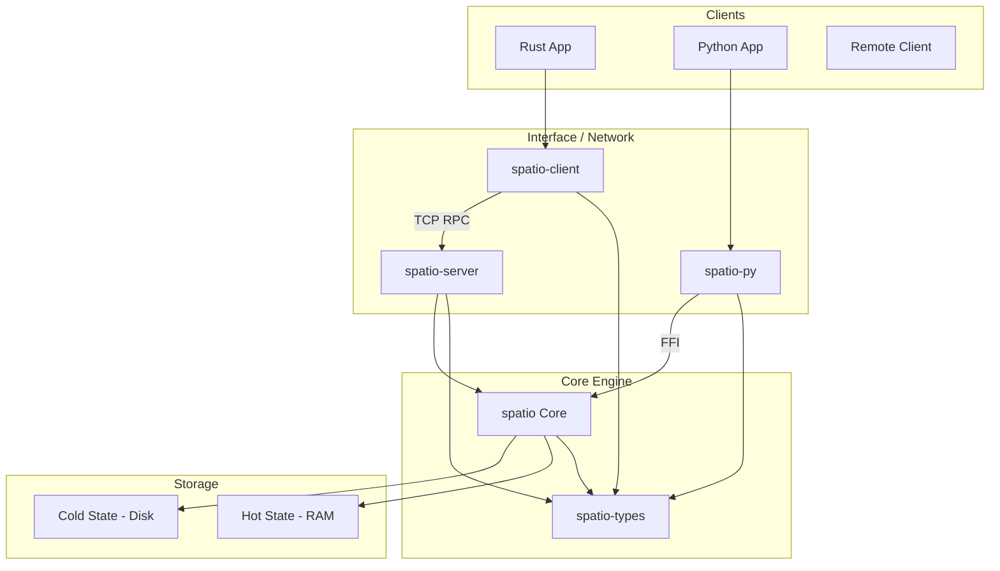

# Spatio Architecture

Spatio is a high-performance, spatio-temporal database designed for tracking moving objects. It is organized as a Cargo workspace with multiple crates, each serving a specific role in the ecosystem.

## Workspace Structure

The project is divided into the following crates:

### Core Layer

- **`spatio` (`crates/core`)**:
  - The core database engine.
  - Implements the "Hot/Cold" architecture.
  - **Hot State**: In-memory `DashMap` + R*-tree for real-time spatial queries.
  - **Cold State**: Append-only log files for historical trajectory persistence.
  - No network dependencies; purely embedded.

- **`spatio-types` (`crates/types`)**:
  - Shared primitive types used across the ecosystem.
  - Defines `Point3d`, `BoundingBox`, `Polygon`, etc.
  - Serializaton logic (Serde, GeoJSON).
  - Dependency for all other crates to ensure type compatibility.

### Application Layer

- **`spatio-server` (`crates/server`)**:
  - A lightweight TCP server wrapper around `spatio`.
  - Exposes the database API via a custom RPC protocol (using `tarpc`).
  - Handles concurrent connections and offloads blocking DB operations to a thread pool.
  - Intended for remote access or multi-process architectures.

- **`spatio-client` (`crates/client`)**:
  - Native Rust RPC client for `spatio-server`.
  - Provides a strongly-typed async API to interact with a remote Spatio instance.
  - Supports TCP transport (and optional HTTP).

### Interface Layer

- **`spatio-py` (`crates/py`)**:
  - Python bindings for the core `spatio` engine using `PyO3`.
  - Allows using Spatio as a native Python library (`import spatio`).
  - Bypasses the server/client layer for maximum performance in Python applications.

## Component Interaction Diagram

## Data Flow

### Write Path (Upsert)
1. **Request**: A location update is received (via embedded call, Python call, or RPC).
2. **Hot State Update**: The current position is updated in the in-memory `DashMap` and Spatial Index. This is lock-free or uses fine-grained locking for high currency.
3. **Cold State Append**: The update is buffered in an in-memory write buffer.
   - **Buffering**: Writes are not immediately flushed to disk. They are stored in a count-based buffer (default: 512 records).
   - **Flushing**: When the buffer is full (`pending_writes >= buffer_size`), the data is explicitly flushed to the log file.
   - **Configuration**: Controlled via `PersistenceConfig` (`buffer_size`).

### Read Path (Spatial Query)
1. **Hot Query**: Radius/BBox queries scan the in-memory R*-tree.
2. **Filtering**: Results are filtered by TTL (time-to-live) and other constraints.
3. **Return**: Current locations are returned immediately.

### Read Path (Trajectory Query)
1. **Buffer Check**: The in-memory buffer in `ColdState` is checked for recent history.
2. **Disk Scan**: If more history is needed, the append-only log is scanned efficiently (or via index if available).

## Threading Model

- **Core**: Thread-safe, mostly lock-free reading. Writing generally involves locking for coordination but is optimized for high throughput.
- **Server**: Async-first (Tokio). Blocking database operations (disk I/O, heavy spatial calcs) are offloaded to `spawn_blocking` to keep the event loop responsive.
